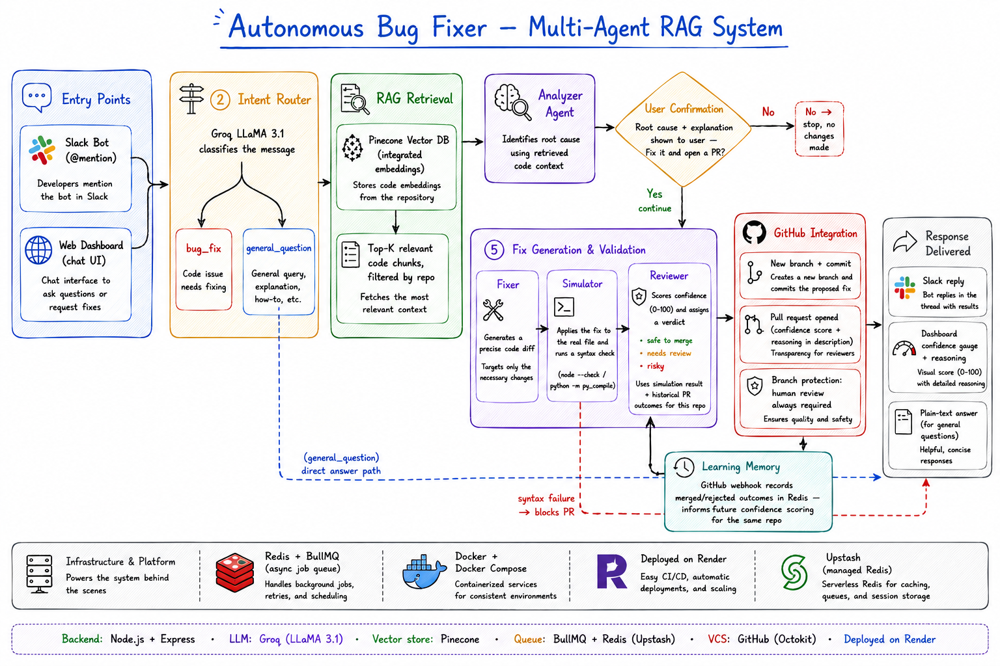

# Multi-Agent-RAG-Powered-Autonomous-System

A multi-agent AI system that turns a plain-English bug report into a reviewed, ready-to-merge GitHub pull request — triggered from Slack or a web dashboard.


## Overview

Most AI coding tools stop at suggesting a fix. This project goes further: it reads the actual codebase, traces a reported bug to its root cause, asks the user for confirmation, generates a real code diff, validates it before anything is committed, and opens a pull request — with a self-assigned confidence score and written reasoning attached.

Nothing merges automatically. Every fix is simulated for correctness, scored for confidence, and still requires a human to approve the pull request, regardless of how confident the system claims to be.

## Key features

- **Codebase-aware fixes (RAG).** The repository is indexed into Pinecone using integrated embeddings, so every fix is grounded in the actual code rather than the error message alone.
- **Intent routing.** A classification step distinguishes genuine bug reports from general questions about the codebase, so the system never opens an unnecessary pull request.
- **Human-in-the-loop confirmation.** The system analyzes the bug and presents the root cause first. Nothing is fixed or committed until the user explicitly confirms.
- **Multi-agent pipeline.** Three specialized agents — Analyzer, Fixer, Reviewer — each handle one part of the task instead of a single model doing everything at once.
- **Fix simulation.** Before a pull request is opened, the proposed fix is applied to the real file and syntax-checked. A failed simulation blocks the PR and forces the confidence score down, regardless of how well-reasoned the fix appears.
- **Confidence scoring.** The Reviewer agent scores every fix from 0-100 with an explicit verdict and reasoning, factoring in the simulation result and the repository's fix history.
- **Learning memory.** A GitHub webhook records whether past automated PRs were merged or rejected, and that history is factored into future reviews for the same repository.
- **Asynchronous processing.** Requests are handled through a Redis-backed job queue (BullMQ), so the API responds immediately and the UI polls for live progress instead of blocking on a single long request.
- **Two entry points.** The same backend pipeline can be triggered from a Slack mention or a web dashboard.

## System Architecture

<p align="center">
  
</p>

<p align="center">
  <em>
    End-to-end architecture of the Autonomous Bug Fixer — Multi-Agent RAG System,
    illustrating intent routing, retrieval-augmented generation (RAG), multi-agent
    analysis, automated fix generation, GitHub integration, continuous learning,
    and response delivery.
  </em>
</p>


## How it works

1. **Trigger.** A bug is reported through Slack or the web dashboard.
2. **Intent routing.** The message is classified as a bug report or a general question. General questions are answered directly using RAG, without going further.
3. **RAG retrieval.** The indexed repository is searched for the most relevant code chunks.
4. **Analysis.** The Analyzer agent identifies the root cause using the bug report and the retrieved code.
5. **Confirmation.** The root cause and explanation are shown to the user, who chooses whether to proceed.
6. **Fix generation.** If confirmed, the Fixer agent generates a precise code diff.
7. **Simulation.** The fix is applied to the real file content and syntax-checked. A failure here blocks the pull request.
8. **Review.** The Reviewer agent scores confidence, assigns a verdict, and explains its reasoning, taking the simulation result and repository history into account.
9. **Pull request.** If the simulation passed, a new branch is created, the fix is committed, and a pull request is opened with the full analysis in its description. Branch protection means the PR still requires human approval before merging.
10. **Learning memory.** When the PR is later merged or closed, a GitHub webhook updates its recorded outcome, which future reviews on the same repository take into account.
11. **Response.** The result — or a plain-text answer, for general questions — is returned through whichever channel triggered the request.

## Tech stack

| Layer | Technology |
|---|---|
| Backend | Node.js, Express |
| LLM | Groq (LLaMA 3.1) |
| Vector store | Pinecone (integrated embeddings) |
| Job queue | BullMQ, Redis |
| Source control | GitHub API (Octokit), GitHub webhooks |
| Chat integration | Slack Bolt |
| Dashboard | HTML, CSS, vanilla JavaScript |
| Infrastructure | Docker, Docker Compose |
| Deployment | Render (app), Upstash (managed Redis) |

## Project structure

```
├── src/
│   ├── server.js                Express app entry point
│   ├── api/
│   │   ├── auth.js              GitHub OAuth flow
│   │   ├── repos.js             Repository indexing endpoint
│   │   ├── sentinel.js          Pipeline endpoints (analyze / confirm / status)
│   │   └── githubWebhook.js     Receives PR merged/closed events
│   ├── agents/
│   │   ├── analyzer.js          Root cause analysis
│   │   ├── fixer.js             Code fix generation
│   │   ├── reviewer.js          Confidence scoring and verdict
│   │   └── router.js            Intent classification
│   ├── rag/
│   │   ├── indexer.js           Repository indexing into Pinecone
│   │   └── retriever.js         Relevant chunk retrieval
│   ├── simulation/
│   │   └── simulator.js         Syntax validation before a PR is opened
│   ├── queue/
│   │   ├── redisQueue.js        BullMQ queue definition
│   │   └── worker.js            Background job processing
│   ├── github/
│   │   └── prCreator.js         Branch, commit, and PR creation
│   ├── slack/
│   │   └── slackBot.js          Slack event handling
│   └── utils/
│       ├── memory.js            Fix history tracking (learning memory)
│       ├── pendingFixes.js       Temporary storage for unconfirmed analyses
│       └── codeMatch.js         Whitespace-tolerant code matching
├── dashboard/
│   └── index.html               Web dashboard (repo connect + chat)
├── architecture-diagram.svg
├── Dockerfile
├── docker-compose.yml
└── .env
```

## Getting started

### Prerequisites

- Node.js and npm
- Docker (recommended) or a local Redis instance
- A GitHub account
- A Groq API key
- A Pinecone account and index
- A Slack workspace (optional — only needed for the Slack integration)

### Environment variables

Create a `.env` file in the project root:

```
PORT=8080

# Redis — set REDIS_HOST for Docker/local, or REDIS_URL for a hosted instance
REDIS_HOST=localhost
REDIS_URL=

# GitHub OAuth
GITHUB_CLIENT_ID=your_github_client_id
GITHUB_CLIENT_SECRET=your_github_client_secret
GITHUB_WEBHOOK_SECRET=your_webhook_secret
GITHUB_TOKEN=your_github_personal_access_token

# Groq
GROQ_API_KEY=your_groq_key

# Pinecone
PINECONE_API_KEY=your_pinecone_key
PINECONE_INDEX=your_pinecone_index_name

# Auth
JWT_SECRET=your_jwt_secret

# Slack
SLACK_BOT_TOKEN=your_slack_bot_token
SLACK_SIGNING_SECRET=your_slack_signing_secret
```

### Running locally with Docker

```bash
docker-compose up --build
```

This starts the application (Express on port 8080, Slack bot on port 3000) alongside a Redis container.

### Running locally without Docker

A local Redis instance must be running on port 6379.

```bash
npm install
node src/server.js
```

### Setting up GitHub OAuth

1. Go to GitHub Settings → Developer settings → OAuth Apps → New OAuth App.
2. Set the callback URL to `<your-app-url>/api/auth/callback`.
3. Copy the client ID and client secret into `.env`.
4. Generate a personal access token (classic) with `repo` and `workflow` scopes, and add it to `.env` as `GITHUB_TOKEN`.

### Setting up the GitHub webhook (learning memory)

1. In the target repository, go to Settings → Webhooks → Add webhook.
2. Set the payload URL to `<your-app-url>/api/github/webhook`.
3. Set the content type to `application/json`.
4. Set the secret to the same value as `GITHUB_WEBHOOK_SECRET` in `.env`.
5. Select "Let me select individual events" and check only "Pull requests."

### Setting up the Slack app

1. Create a new Slack app at `api.slack.com/apps`.
2. Add the following bot token scopes: `app_mentions:read`, `channels:history`, `chat:write`, `im:history`, `im:write`.
3. Install the app to your workspace and copy the bot token into `.env`.
4. Under Event Subscriptions, set the request URL to `<your-tunnel-or-app-url>:3000/slack/events` and subscribe to the `app_mention` bot event.

## Usage

### Web dashboard

1. Open `<your-app-url>/dashboard/index.html`.
2. Click "Connect GitHub" and authorize the app.
3. Enter the repository owner and name, then click "Index repository."
4. Describe a bug in the chat box. The dashboard shows the root cause and asks for confirmation before generating a fix. Once confirmed, it shows the simulation result, confidence gauge, reasoning, and a link to the generated pull request.

### Slack

Mention the bot in any channel it has been added to:

```
@AutonomousBugFixer fix this bug: submitSolution crashes when the API response is invalid
```

## Safeguards

- **Human confirmation before any change.** The system never generates a fix or opens a pull request without the user first reviewing the root cause and explicitly agreeing to proceed.
- **Fix simulation.** Every proposed fix is applied to the real file and syntax-checked before a pull request is created. A failed simulation blocks the PR outright.
- **Branch protection.** The target repository requires pull request review before merging, so no fix — regardless of confidence score — reaches the default branch without a human decision.
- **Confidence scoring.** Every fix is accompanied by a numeric confidence score and a written explanation of any uncertainty.
- **Intent routing.** General questions are answered directly, without generating an unnecessary fix or PR.

## Possible next steps

- Run the Slack bot on the same public port as the main application, so it also works in the deployed environment.
- Extend fix simulation to more languages beyond JavaScript and Python.
- Add unit-level test execution as part of the simulation step, not just a syntax check.
- Build a history view in the dashboard showing past fixes and their outcomes per repository.

## License

This project is available for personal and educational use.

---

## Built by

**Himanshi Sonkusale**

GitHub: [@himanshisonkusale](https://github.com/himanshisonkusale)